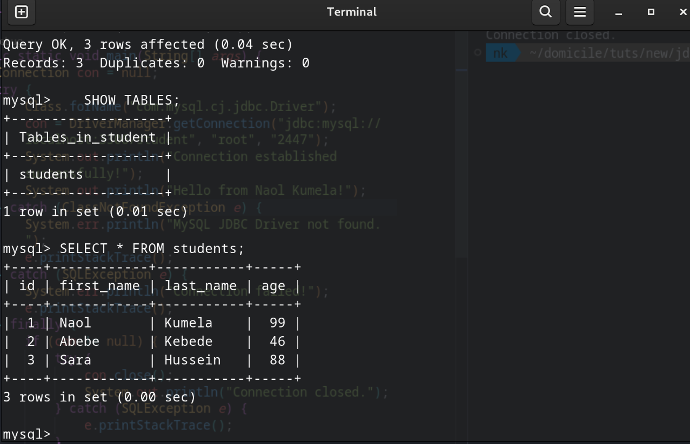
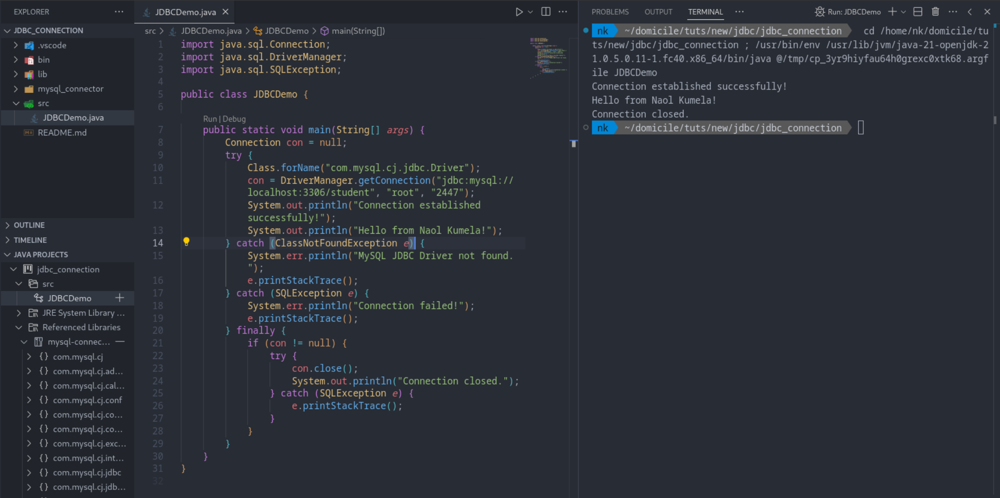
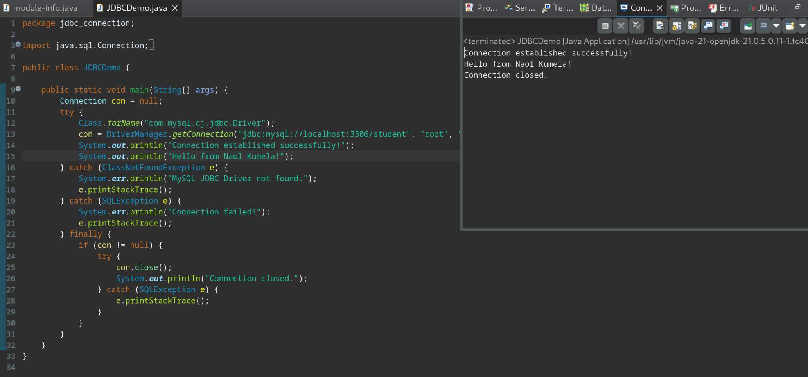
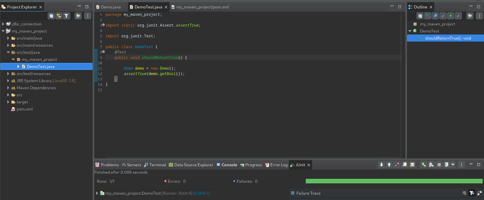
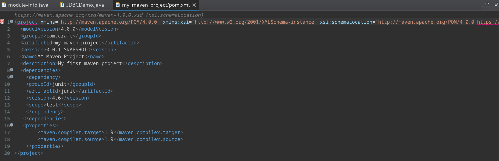
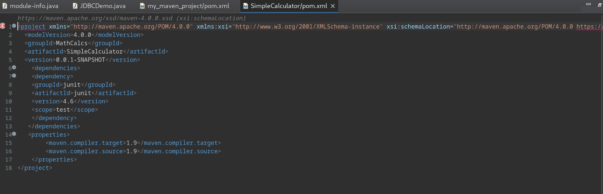
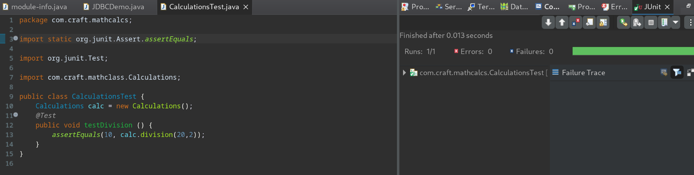
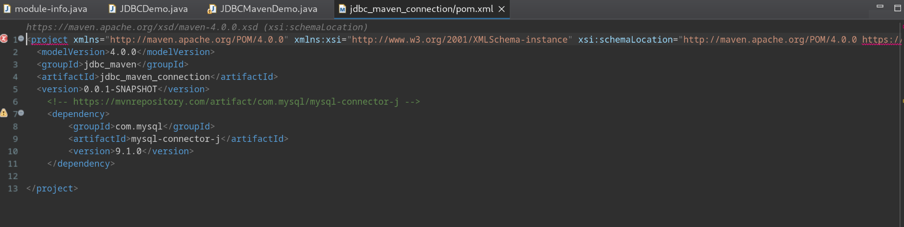
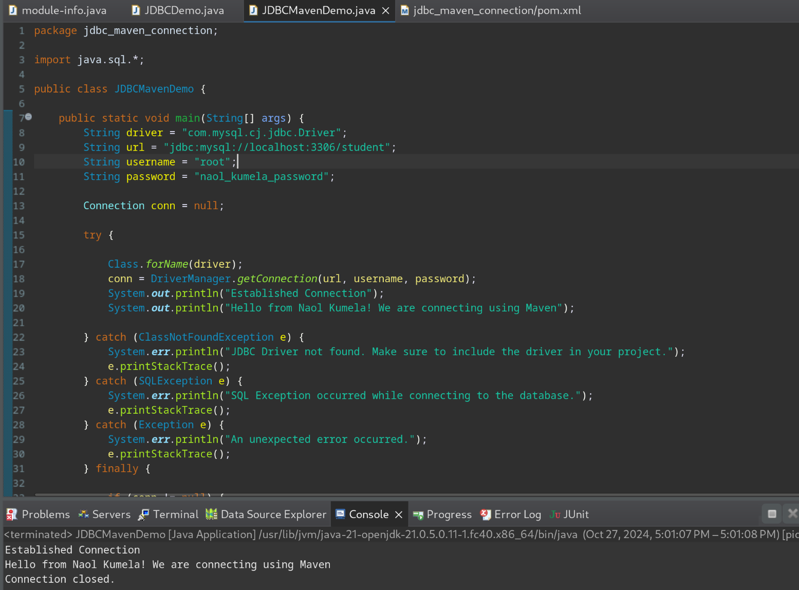

# Enterprise Application Development Course

# Enterprise Application Development Course

## Naol Kumela, ID: ATR/3173/13

| Name       | Naol Kumela |
| ---------- | ----------- |
| Student ID | ATR/3173/13 |

# Instructor: Mr. Yared Y.\*\*

# Java JDBC Connection Examples

This repository contains several Java programs demonstrating database connections using JDBC. These examples illustrate different approaches to connecting to a MySQL database, including using both Eclipse and VSCode IDEs, and also includes a simple math class example.

## Project Descriptions

- **`jdbc_connection` (Eclipse):** This project establishes a connection to a MySQL database using JDBC. It demonstrates a basic connection with error handling and resource management.
- **`jdbc_maven_connection` (Eclipse):** This project is similar to `jdbc_connection` but uses Maven for dependency management. This is generally preferred in a production environment to avoid manual download and management of JDBC drivers.
- **`com.craft.mathclass` (Eclipse):** This project showcases a basic Java class for mathematical calculations, specifically division.
- **`JDBCDemo` (VSCode):** This is a functionally identical project to the `jdbc_connection` project, but created using VS Code.

## Concepts Demonstrated

- **JDBC Connection:** Establishing a connection to a MySQL database.
- **Error Handling:** Implementing try-catch blocks to handle potential exceptions (e.g., `ClassNotFoundException`, `SQLException`).

- **Dependency Management (Maven):** Using Maven for managing dependencies, which is crucial for ensuring that the required JDBC driver is included.

## Running the Projects

To run the `jdbc_connection`, `jdbc_maven_connection`, or `JDBCDemo` projects:

1.  Ensure you have a MySQL server running locally.
2.  Have the appropriate JDBC driver (e.g., `mysql-connector-java`) available, either manually downloaded or managed via Maven.
3.  **Crucially:** If using `jdbc_maven_connection`, ensure you have Maven properly configured. If using `jdbc_connection` or `JDBCDemo` ensure the MySQL Connector/J JAR file is on the project's build path.

## Some Outputs from the Lab

