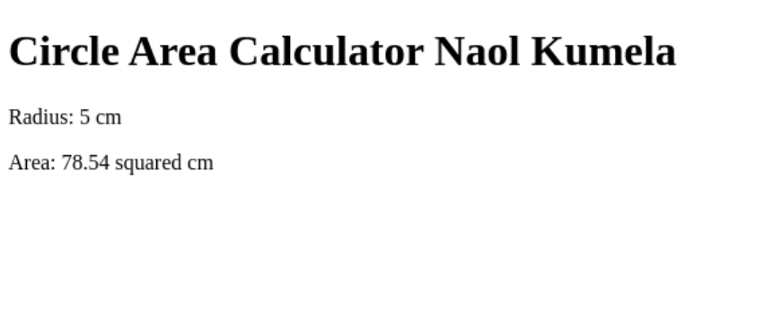

# Circle Area Calculator Servlet

## Overview

This lab involves creating a Java Servlet that calculates the area of a circle based on user input. The servlet retrieves the radius and unit parameters from the HTTP request, calculates the area using the formula `area = π * radius^2`, and returns the result as an HTML response.

## Requirements

- Java Development Kit (JDK)
- Apache Tomcat or any other Java EE compatible web server
- A web browser to test the servlet

### Servlet Implementation

The `CircleServlet` class handles HTTP GET requests to calculate the area of a circle. It retrieves the radius and unit parameters from the request, performs the calculation, and returns the result as an HTML response.

The `web.xml` file maps the `CircleServlet` to the `/circle` URL pattern.

## How to Run

### 1. Compile and Package the Application
Use your preferred build tool (e.g., Maven) to compile and package the application.

### 2. Deploy to Server
Deploy the compiled application to your web server (e.g., Apache Tomcat).

### 3. Access the Servlet
Open your web browser and navigate to:
```
http://localhost:8080/Circle/circle?radius=5&unit=cm
```



> **Note:** Replace `localhost:8080` with your server's address and port, and adjust the radius and unit parameters as needed.

## Conclusion

This lab demonstrates how to create a simple Java Servlet to calculate the area of a circle based on user input. By following the steps outlined above, you can deploy and test the servlet in your local development environment.
